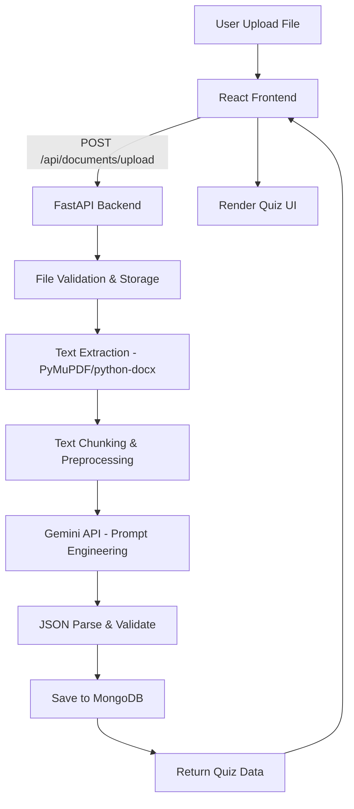

# 🧠 AIQuiz — Implementation Plan

> **AI-Powered MCQ Generator** | Tech Lead Review Document
> Framework recommendation: **FastAPI** (async, type-safe, auto-docs, file handling tốt hơn Flask)

---

## 1. Kiến trúc hệ thống & Data Flow



### Request Lifecycle chi tiết:

1. **User** bấm Upload → Frontend gửi `multipart/form-data`
2. **FastAPI** validate file (type, size ≤ 10MB)
3. **Text Extractor** đọc nội dung → plain text
4. **Preprocessor** chunk text nếu vượt context window (30k tokens)
5. **Gemini Service** nhận text + system prompt → trả JSON câu hỏi
6. **Parser** validate JSON schema, retry nếu lỗi format (max 3 lần)
7. **MongoDB** lưu document metadata + quiz + questions
8. **Response** trả quiz data → Frontend render giao diện làm bài

---

## 2. Database Schema (MongoDB)

### Collection: `users`
```json
{
  "_id": "ObjectId",
  "email": "string",
  "password_hash": "string",
  "full_name": "string",
  "created_at": "datetime",
  "updated_at": "datetime"
}
```

### Collection: `documents`
```json
{
  "_id": "ObjectId",
  "user_id": "ObjectId",
  "original_filename": "string",
  "file_type": "pdf | docx | txt",
  "file_size_bytes": "int",
  "extracted_text": "string",
  "text_length": "int",
  "upload_status": "processing | completed | failed",
  "created_at": "datetime"
}
```

### Collection: `quizzes`
```json
{
  "_id": "ObjectId",
  "document_id": "ObjectId",
  "user_id": "ObjectId",
  "title": "string",
  "description": "string",
  "total_questions": "int",
  "difficulty": "easy | medium | hard | mixed",
  "language": "string",
  "created_at": "datetime"
}
```

### Collection: `questions`
```json
{
  "_id": "ObjectId",
  "quiz_id": "ObjectId",
  "question_text": "string",
  "options": [
    { "key": "A", "text": "string" },
    { "key": "B", "text": "string" },
    { "key": "C", "text": "string" },
    { "key": "D", "text": "string" }
  ],
  "correct_answer": "A | B | C | D",
  "explanation": "string",
  "order": "int"
}
```

### Collection: `quiz_attempts`
```json
{
  "_id": "ObjectId",
  "quiz_id": "ObjectId",
  "user_id": "ObjectId",
  "answers": [{ "question_id": "ObjectId", "selected": "string" }],
  "score": "int",
  "total": "int",
  "completed_at": "datetime"
}
```

### Indexes
```python
# documents
db.documents.create_index("user_id")

# quizzes  
db.quizzes.create_index("document_id")
db.quizzes.create_index("user_id")

# questions
db.questions.create_index("quiz_id")

# quiz_attempts
db.quiz_attempts.create_index([("user_id", 1), ("quiz_id", 1)])
```

---

## 3. API Contracts

### 3.1 Upload & Generate Quiz
```
POST /api/documents/upload
Content-Type: multipart/form-data

Request:
  - file: File (required, max 10MB, .pdf/.docx/.txt)
  - num_questions: int (optional, default=10, max=30)
  - difficulty: string (optional, default="mixed")
  - language: string (optional, default="vi")

Response 200:
{
  "document_id": "string",
  "quiz": {
    "id": "string",
    "title": "string",
    "total_questions": 10,
    "questions": [
      {
        "id": "string",
        "question_text": "string",
        "options": [
          {"key": "A", "text": "..."},
          {"key": "B", "text": "..."},
          {"key": "C", "text": "..."},
          {"key": "D", "text": "..."}
        ],
        "order": 1
      }
    ]
  }
}

Error 400: { "detail": "File type not supported" }
Error 413: { "detail": "File too large (max 10MB)" }
Error 422: { "detail": "Could not extract text" }
Error 503: { "detail": "AI service unavailable" }
```

### 3.2 Get Quiz by ID
```
GET /api/quizzes/{quiz_id}

Response 200:
{
  "id": "string",
  "title": "string",
  "questions": [...] // same as above, no correct_answer
}
```

### 3.3 Submit Quiz Attempt
```
POST /api/quizzes/{quiz_id}/submit

Request:
{
  "answers": [
    { "question_id": "string", "selected": "B" }
  ]
}

Response 200:
{
  "score": 7,
  "total": 10,
  "percentage": 70.0,
  "results": [
    {
      "question_id": "string",
      "selected": "B",
      "correct_answer": "A",
      "is_correct": false,
      "explanation": "string"
    }
  ]
}
```

### 3.4 Quiz History
```
GET /api/quizzes?page=1&limit=10

Response 200:
{
  "quizzes": [...],
  "total": 25,
  "page": 1,
  "pages": 3
}
```

---

## 4. Xử lý File & Tích hợp AI

### 4.1 Thư viện Python

| File Type | Library | Lý do chọn |
|-----------|---------|-------------|
| **PDF** | `PyMuPDF (fitz)` | Nhanh, chính xác, xử lý tốt tiếng Việt, ít dependency |
| **DOCX** | `python-docx` | Lightweight, API rõ ràng |
| **TXT** | Built-in `open()` | Detect encoding với `chardet` |

```python
# app/services/text_extractor.py
import fitz  # PyMuPDF
from docx import Document
import chardet

class TextExtractor:
    @staticmethod
    def extract(file_bytes: bytes, file_type: str) -> str:
        extractors = {
            "pdf": TextExtractor._extract_pdf,
            "docx": TextExtractor._extract_docx,
            "txt": TextExtractor._extract_txt,
        }
        extractor = extractors.get(file_type)
        if not extractor:
            raise ValueError(f"Unsupported: {file_type}")
        return extractor(file_bytes)

    @staticmethod
    def _extract_pdf(file_bytes: bytes) -> str:
        doc = fitz.open(stream=file_bytes, filetype="pdf")
        return "\n".join(page.get_text() for page in doc)

    @staticmethod
    def _extract_docx(file_bytes: bytes) -> str:
        from io import BytesIO
        doc = Document(BytesIO(file_bytes))
        return "\n".join(p.text for p in doc.paragraphs if p.text.strip())

    @staticmethod
    def _extract_txt(file_bytes: bytes) -> str:
        detected = chardet.detect(file_bytes)
        encoding = detected.get("encoding", "utf-8")
        return file_bytes.decode(encoding)
```

### 4.2 System Prompt cho Gemini

```python
SYSTEM_PROMPT = """You are an expert educational assessment designer. Your task is to generate high-quality multiple-choice questions (MCQs) based STRICTLY on the provided source material.

## RULES (MUST FOLLOW):
1. **Factual accuracy**: Every question and answer MUST be directly supported by the source text. NEVER fabricate or infer information not present.
2. **Distractors**: Wrong answers must be plausible and logically related to the topic, but clearly incorrect based on the source material. Avoid absurd or obviously wrong options.
3. **Coverage**: Distribute questions across different sections/topics of the source material evenly.
4. **Clarity**: Questions must be unambiguous with exactly ONE correct answer.
5. **Language**: Generate questions in {language}.

## OUTPUT FORMAT (STRICT JSON):
Return ONLY a valid JSON object. No markdown, no code fences, no extra text.

{{
  "title": "Quiz title based on document content",
  "description": "Brief description of the quiz topic",
  "questions": [
    {{
      "question_text": "Clear, specific question?",
      "options": [
        {{"key": "A", "text": "Option A"}},
        {{"key": "B", "text": "Option B"}},
        {{"key": "C", "text": "Option C"}},
        {{"key": "D", "text": "Option D"}}
      ],
      "correct_answer": "A",
      "explanation": "Brief explanation why A is correct, referencing the source."
    }}
  ]
}}

Generate exactly {num_questions} questions at {difficulty} difficulty level.
"""
```

### 4.3 Gemini Service

```python
# app/services/gemini_service.py
import google.generativeai as genai
import json, re

class GeminiService:
    def __init__(self, api_key: str):
        genai.configure(api_key=api_key)
        self.model = genai.GenerativeModel("gemini-2.0-flash")

    async def generate_quiz(
        self, text: str, num_questions: int = 10,
        difficulty: str = "mixed", language: str = "vi",
        max_retries: int = 3
    ) -> dict:
        prompt = SYSTEM_PROMPT.format(
            language=language,
            num_questions=num_questions,
            difficulty=difficulty
        )
        # Truncate text if too long (~120k chars ≈ 30k tokens)
        if len(text) > 120000:
            text = text[:120000]

        for attempt in range(max_retries):
            try:
                response = self.model.generate_content(
                    [prompt, f"SOURCE MATERIAL:\n{text}"],
                    generation_config=genai.GenerationConfig(
                        response_mime_type="application/json",
                        temperature=0.3,
                    ),
                )
                return self._parse_response(response.text)
            except json.JSONDecodeError:
                if attempt == max_retries - 1:
                    raise
                continue

    def _parse_response(self, text: str) -> dict:
        cleaned = re.sub(r"```json\s*|\s*```", "", text).strip()
        data = json.loads(cleaned)
        # Validate structure
        assert "questions" in data
        for q in data["questions"]:
            assert all(k in q for k in
                ["question_text", "options", "correct_answer"])
            assert len(q["options"]) == 4
        return data
```

---

## 5. Lộ trình phát triển (Roadmap)

### Phase 1: Foundation Setup (2-3 ngày)

- [x] Init Git repo
- [ ] Setup FastAPI project structure
- [ ] Setup MongoDB connection (Motor async driver)
- [ ] Config management (Pydantic Settings, `.env`)
- [ ] Setup React (Vite) + routing
- [ ] Docker Compose cho MongoDB

```
backend/
├── app/
│   ├── __init__.py
│   ├── main.py              # FastAPI app
│   ├── config.py             # Settings
│   ├── database.py           # MongoDB connection
│   ├── models/               # Pydantic models
│   │   ├── document.py
│   │   ├── quiz.py
│   │   └── question.py
│   ├── routers/              # API routes
│   │   ├── documents.py
│   │   └── quizzes.py
│   ├── services/             # Business logic
│   │   ├── text_extractor.py
│   │   ├── gemini_service.py
│   │   └── quiz_service.py
│   └── utils/
│       └── text_processing.py
├── requirements.txt
├── .env.example
└── Dockerfile

frontend/
├── src/
│   ├── components/
│   │   ├── FileUpload.jsx
│   │   ├── QuizPlayer.jsx
│   │   ├── QuestionCard.jsx
│   │   ├── ResultsSummary.jsx
│   │   └── QuizHistory.jsx
│   ├── pages/
│   │   ├── HomePage.jsx
│   │   ├── QuizPage.jsx
│   │   └── ResultsPage.jsx
│   ├── services/
│   │   └── api.js
│   ├── App.jsx
│   └── main.jsx
├── package.json
└── Dockerfile
```

### Phase 2: Core Backend Logic (3-4 ngày)

- [ ] Text Extraction service (PDF, DOCX, TXT)
- [ ] Text preprocessing & chunking utility
- [ ] Gemini API integration + prompt engineering
- [ ] JSON validation & retry logic
- [ ] Upload endpoint + Quiz generation pipeline
- [ ] Unit tests cho extraction & parsing

### Phase 3: Full API + Database (2-3 ngày)

- [ ] CRUD endpoints cho Quizzes
- [ ] Submit quiz + scoring logic
- [ ] Quiz history + pagination
- [ ] Error handling middleware
- [ ] Input validation (file size, type)
- [ ] API documentation (auto-generated Swagger)

### Phase 4: Frontend Integration (3-4 ngày)

- [ ] File upload component (drag & drop)
- [ ] Loading states + progress indicator
- [ ] Quiz player interface (navigation, timer optional)
- [ ] Results page (score, corrections, explanations)
- [ ] Quiz history page
- [ ] Responsive design + dark mode

### Phase 5: Polish & Deploy (2-3 ngày)

- [ ] Authentication (JWT - optional nhưng khuyến khích)
- [ ] Rate limiting
- [ ] Docker Compose (backend + frontend + MongoDB)
- [ ] CI/CD pipeline
- [ ] README.md portfolio-ready
- [ ] Deploy (Railway / Render / VPS)

---

## 6. Xử lý rủi ro & Edge Cases

### 6.1 File quá lớn (> 10MB)

```python
# app/routers/documents.py
from fastapi import UploadFile, HTTPException

MAX_FILE_SIZE = 10 * 1024 * 1024  # 10MB

@router.post("/upload")
async def upload(file: UploadFile):
    contents = await file.read()
    if len(contents) > MAX_FILE_SIZE:
        raise HTTPException(413, "File exceeds 10MB limit")
```

### 6.2 Văn bản vượt context window

```python
# app/utils/text_processing.py
import tiktoken

MAX_TOKENS = 28000  # Reserve 2k cho prompt + response

def smart_truncate(text: str, max_tokens: int = MAX_TOKENS) -> str:
    """Cắt text thông minh theo paragraph boundaries."""
    enc = tiktoken.encoding_for_model("gpt-4")  # Ước lượng
    tokens = enc.encode(text)

    if len(tokens) <= max_tokens:
        return text

    # Cắt theo paragraph để không bị gãy câu
    truncated = enc.decode(tokens[:max_tokens])
    last_para = truncated.rfind("\n\n")
    if last_para > len(truncated) * 0.8:
        truncated = truncated[:last_para]

    return truncated
```

**Strategy nâng cao**: Nếu text quá dài, chia thành chunks → gọi Gemini nhiều lần → merge questions → deduplicate.

### 6.3 Gemini API lỗi / timeout

```python
# Retry with exponential backoff
import asyncio
from tenacity import retry, stop_after_attempt, wait_exponential

@retry(
    stop=stop_after_attempt(3),
    wait=wait_exponential(multiplier=1, min=2, max=10)
)
async def call_gemini_with_retry(self, prompt, text):
    try:
        response = await asyncio.wait_for(
            self.model.generate_content_async([prompt, text]),
            timeout=60  # 60s timeout
        )
        return response
    except asyncio.TimeoutError:
        raise Exception("Gemini API timeout after 60s")
```

### 6.4 Bảng tổng hợp rủi ro

| Rủi ro | Giải pháp | Fallback |
|--------|-----------|----------|
| File không extract được text | Validate file có text, báo lỗi rõ | Suggest file khác |
| File scan/image PDF | Detect empty text, thông báo user | Gợi ý OCR (future) |
| Gemini trả sai JSON format | Retry 3 lần + `response_mime_type="application/json"` | Trả lỗi 503 |
| Gemini rate limit (429) | Exponential backoff + queue | Thông báo thử lại sau |
| Text quá ngắn (< 100 words) | Validate minimum length | Báo lỗi "not enough content" |
| Duplicate questions | Hash-based dedup trên question_text | Accept minor duplicates |
| MongoDB connection lost | Connection pooling + health check | Circuit breaker |

### 6.5 Security Best Practices

- **File upload**: Validate MIME type + extension, không tin `Content-Type` header
- **Sanitize text**: Strip potential injection trước khi gửi Gemini
- **Environment variables**: Không commit API keys, dùng `.env`
- **CORS**: Chỉ allow frontend origin
- **Rate limiting**: `slowapi` — 10 uploads/user/hour

---

## 7. Key Dependencies

### Backend (`requirements.txt`)
```
fastapi==0.115.*
uvicorn[standard]==0.34.*
motor==3.6.*              # Async MongoDB driver
pymongo==4.10.*
python-multipart==0.0.*   # File upload
PyMuPDF==1.25.*           # PDF extraction
python-docx==1.1.*        # DOCX extraction
chardet==5.2.*            # Encoding detection
google-generativeai==0.8.* # Gemini API
pydantic-settings==2.7.*  # Config management
tenacity==9.0.*           # Retry logic
python-jose[cryptography] # JWT (Phase 5)
passlib[bcrypt]           # Password hashing (Phase 5)
pytest==8.*               # Testing
httpx==0.28.*             # Test client
```

### Frontend (`package.json`)
```
react, react-router-dom, axios,
react-dropzone, lucide-react,
sonner (toast notifications)
```

---

> **Tổng thời gian ước tính: 12-17 ngày làm việc**
>
> Recommendation: Bắt đầu từ Phase 1 + 2 trước, đảm bảo core pipeline
> `Upload → Extract → Gemini → JSON` hoạt động end-to-end trước khi
> làm Frontend.
